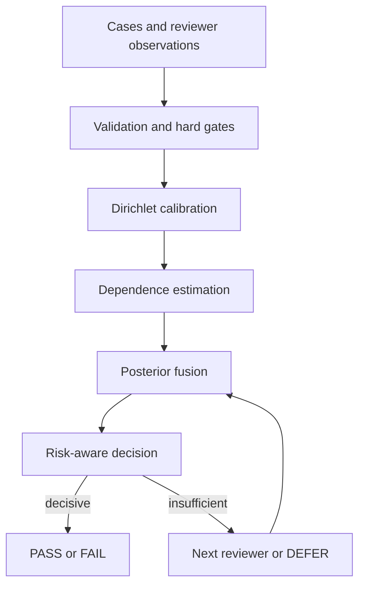

# Corum MVP Design

> Canonical repository design. No external workflow plugin is required.

**Status:** Approved for autonomous implementation

**Approval record:** On 2026-08-28, the project owner authorized autonomous design,
implementation, testing, evaluation, reporting, and continuous GitHub delivery. The
owner explicitly requested the lowest-cost and fastest path that can honestly test
feasibility and algorithmic capability.

## 1. Project identity and clean-room boundary

Corum is a new, independent personal open-source project created and implemented
from scratch by Franz Xu. It is a general-purpose framework for evidence-aware,
dependence-aware consensus among imperfect reviewers.

The repository must not contain or mention any former employer, internal platform,
internal code, prompt, schema, interface, data, log, screenshot, benchmark result, or
non-public naming. Public datasets and established mathematical methods must be cited
to their original sources. Project claims must distinguish the novel system design and
engineering combination from the prior mathematical tools it uses.

The canonical repository target is:

- GitHub owner: `IcantFind-a-username`
- Repository: `Corum`
- Python package: `corum`
- License: Apache-2.0

The connected GitHub integration can write to an existing repository but cannot create
one. Local commits remain the source until the empty remote exists; once it exists, all
history is pushed and subsequent stable milestones are pushed continuously.

## 2. Decision and alternatives

Three approaches were considered:

1. Simulation only: cheapest and excellent for testing statistical behavior, but it
   cannot establish external validity with real model errors.
2. Staged validation: deterministic unit tests, controlled simulation, public-data
   replay, then a small real-reviewer experiment only if earlier gates pass.
3. Live multi-provider first: visually impressive but expensive, difficult to reproduce,
   and unable to separate algorithm defects from provider and prompt variance.

Corum uses approach 2. No paid API call is allowed before the zero-cost stages pass,
and no paid API call is made without an explicit budget confirmation from the owner.

## 3. Goals

The MVP must:

1. Represent binary truth separately from reviewer abstention and execution failure.
2. Learn each reviewer's `2 x 3` observation likelihood from labeled calibration data
   using Dirichlet posteriors.
3. Propagate calibration uncertainty instead of treating posterior means as exact.
4. Reduce duplicate evidence from correlated reviewers without double-counting
   reliability, including a registered joint-likelihood path for fixed reviewer pairs.
5. Produce `PASS`, `FAIL`, or `DEFER` actions using conservative probability thresholds,
   conditional posterior intervals, quorum, and effective sample size.
6. Preserve invalid, timeout, refusal, and not-called states rather than deleting them.
7. Simulate correlated errors, class imbalance, non-random missingness, cold start, and
   model drift with reproducible seeds.
8. Compare against strong, leakage-free baselines.
9. Simulate an adaptive cascade and report reviewer-call and token-cost savings.
10. Generate machine-readable results and a human-readable Markdown evaluation report.
11. Before new components, replay the unchanged static core on cached external
    JudgeBench votes against ordinary and lineage-balanced majority.
12. Provide a public-data adapter and a reproducible Kaggle notebook path for HaluEval
    only after the applicable zero-cost gates permit that work.

## 4. Non-goals

The statistical MVP will not include:

- a web UI, database, hosted service, workflow framework, or agent orchestration layer;
- a universal provider abstraction or production secret management;
- online weight updates, automated policy optimization, or an unrestricted policy DSL;
- claims of production readiness, universal superiority, or legal ownership of abstract
  mathematical ideas;
- redistribution of public datasets when a downloader and checksum are sufficient;
- a promise that three small open models represent all frontier or closed models.

After the statistical usefulness gates pass, the product phase may add a simple local
human-contract form, safe bounded project reading, and optional developer-supplied LLM
API adapters. Human project description, checkpoints, FAIL conditions, and requirement
evidence remain authoritative. Corum owns post-API validation, traceability, consensus,
audit, recommendations, and quality scoring; it does not host secrets or require one
provider.

## 5. Architecture

The package is split into focused units:

- `models.py`: immutable enums and records for cases, reviews, reviewers, calibration,
  fused scores, decisions, and costs.
- `calibration.py`: Dirichlet count fitting and posterior sampling for singleton
  `P(O | Y)` and registered pair-block `P(O_i, O_j | Y)` likelihoods.
- `dependence.py`: error-correlation estimation and design-effect reviewer weights.
- `fusion.py`: legacy power-likelihood fusion and optional fixed pair-block fusion over
  posterior samples.
- `decision.py`: quorum checks and conditional-posterior action policy.
- `cascade.py`: leakage-free reviewer ordering, sequential acquisition, and early stop.
- `simulation.py`: controlled panel generator with common lineage shocks and missingness.
- `metrics.py`: selective performance, calibration, dependence, and cost metrics.
- `experiment.py`: reproducible baseline comparison and bootstrap intervals.
- `datasets/halueval.py`: source validation, deterministic balanced-case construction,
  and train/calibration/test split utilities.
- `cli.py`: minimal commands to run simulations, evaluate a vote file, and render a
  report.

The core library must have no network calls. Dataset download and model inference stay
in scripts or notebooks outside the statistical core.

## 6. Data contract

The latent truth is binary:

- `PASS`: the candidate satisfies the evaluation criterion.
- `FAIL`: the candidate violates the evaluation criterion.

A reviewer's semantic observation is separate:

- `PASS`, `FAIL`, or `ABSTAIN`.

Execution state is also separate:

- `VALID`, `TIMEOUT`, `INVALID`, `REFUSAL`, or `NOT_CALLED`.

Only `VALID` observations contribute directionally. Other states remain in the audit
record and reduce coverage/quorum; remaining votes are never silently re-normalized to
pretend the missing reviewers participated.

Every reviewer has a stable `reviewer_id`, `vendor`, `family`, `lineage`, and non-negative
cost. Calibration and evaluation splits must be disjoint. Reviewer selection and the
"best single" baseline use calibration data only.

## 7. Statistical design

### 7.1 Calibration

For each reviewer and true class `y`, the three observation probabilities follow a
Dirichlet posterior:

`theta[reviewer, y] ~ Dirichlet(alpha_prior[y] + counts[y, :])`.

The MVP supports a conservative pooled parent prior. The prior contributes only a small,
explicit pseudo-count and its share is reported. Fusion samples full `theta` draws; it
does not plug in only the posterior mean.

For a predeclared reviewer pair and each true class, the ordered output pair is one
nine-cell categorical variable. Its `3 x 3` likelihood has a Dirichlet posterior fitted
only from cases where both reviews are `VALID` for the same case and truth. `ABSTAIN` is a
normal third observation category. The joint prior is centered on the outer product of
the two inferred singleton parent priors, not on reviewer-specific posterior means that
would directly add their observed counts again. This is a plug-in empirical-Bayes center:
the pooled parent can indirectly contain the same fit cases, and its uncertainty is not
propagated. The update assumes cases are conditionally exchangeable with a stable joint
cell vector inside each truth/both-valid row. Both truth rows must meet the registered
paired-valid minimum before a pair can be activated.

### 7.2 Dependence adjustment

Reliability is already represented by the likelihood matrix and must not be multiplied
again as an accuracy weight. Dependence alone adjusts information contribution.

Pairwise positive error correlation is estimated on calibration data. For reviewer `i`
within the actually queried subset `S`:

`w_i(S) = 1 / (1 + sum_{j in S, j != i} max(rho_ij, 0))`.

When reviewers are independent, `w_i = 1`. When a perfectly correlated group of `n`
reviewers is present, its total contribution approaches one independent review. A
lineage-level cap provides a conservative fallback when paired calibration data is too
sparse.

The power-likelihood adjustment is retained as a frozen baseline after its first locked
value gate failed one registered dependence stress threshold. The prospective pivot uses
joint likelihoods only for a fixed, globally disjoint pair partition declared without test
access. For blocks assumed conditionally independent given truth:

`P(observations | Y) = product_B P(observations_B | Y)`.

A fully observed pair contributes exactly one joint factor, conditional on both members
being valid, and never its two singleton factors as well. A pair with only one valid member
uses an explicit baseline-compatible approximation: that member's separately calibrated
singleton factor, not a marginal of the sampled joint table. This approximation assumes
the validity/missingness process is ignorable for that fallback; an absent member
contributes no evidence. Remaining singleton blocks use exponent one. Dependence estimates
still provide ESS and diagnostics, but do not temper a joint block a second time.

This block factorization is an explicit modeling assumption, not a proof that all
cross-block dependence is absent. Corum therefore forbids overlapping pairs in this path
and measures held-out NLL, Brier score, decision loss, and negative controls before the
component is admitted. The use of a low-dimensional pair likelihood is informed by the
scope and cautions of
[Cox and Reid (2004)](https://doi.org/10.1093/biomet/91.3.729), but exact block
factorization here depends on Corum's explicit conditional-independence assumption rather
than that paper's composite-likelihood results. The conditional-product
interpretation follows
[Dawid and Studeny (1999)](https://proceedings.mlr.press/r2/dawid99a.html);
the nine-cell count model uses the Dirichlet--compound-multinomial construction associated
with [Mosimann (1962)](https://doi.org/10.1093/biomet/49.1-2.65). These sources motivate
the model; they do not establish that Corum beats a voting baseline.

### 7.3 Fusion and action

For each posterior sample, legacy Corum combines the class prior and each valid
observation's class-conditional likelihood in log space, exponentiated only by the
subset-conditioned dependence weight. The registered pair-block path instead combines
the fixed disjoint joint/singleton factors defined above. Both return the mean probability
of `PASS`, a central
posterior-sampling interval, reviewer count, lineage count, and correlation-adjusted ESS.
An exact known-likelihood path exists for analytic verification; production fusion samples
calibration likelihoods once per experiment context and reuses those parameter draws
across cases.
The exact pair oracle with an empty pair map is the exponent-one naive singleton oracle;
an empty pair map in a sampled `FusionContext` retains the legacy power path for backward
compatibility.

The interval propagates Dirichlet calibration uncertainty conditional on the selected
legacy dependence adjustment or fixed pair partition. Even in pair-block mode it is not a
full-panel joint credible interval: the MVP does not propagate partition-selection
uncertainty, pooled-parent uncertainty, clustered or repeated-case dependence, unmodeled
case-difficulty mixtures, cross-block dependence uncertainty, or higher-order
interactions. Risk thresholds are therefore conservative action policy inputs whose
empirical performance is measured on held-out policy and test splits; they are not
advertised as a formal risk guarantee in correlated or shifted settings.

The decision layer returns:

- `PASS` only when the lower conditional posterior bound is at or above the pass threshold
  and all quorum requirements hold;
- `FAIL` only when the upper conditional posterior bound is at or below the fail threshold
  and all quorum requirements hold;
- otherwise `DEFER` with explicit reason codes.

Entropy and Jensen-Shannon divergence are diagnostic and routing signals only. They do
not independently prove correctness and do not add another reliability weight.

### 7.4 Adaptive cascade

The cascade selects reviewers using calibration-only utility:

`utility = expected_information * novelty / cost`.

It acquires the minimum required initial panel, recomputes dependence weights for only
the queried subset, fuses, and stops only when the same risk
and quorum policy as the full panel is satisfied. Otherwise it requests the next unused
reviewer. Budget exhaustion returns `DEFER`; it never relaxes the safety threshold.

## 8. Evaluation protocol

### 8.1 Zero-cost simulation

Each scenario uses 50 fixed, published seeds with `N_cal = 2,000` and
`N_test = 10,000` per seed:

1. independent heterogeneous reviewers, used to verify the analytic posterior;
2. two near-clone reviewers with error correlation between 0.8 and 0.95;
3. a majority trap with two weak correlated reviewers and one stronger independent one;
4. informative abstention plus schema errors and timeouts on difficult cases;
5. calibration-to-test shift in prevalence, ability, dependence, and one adversarial judge;
6. easy/hard mixture with heterogeneous costs and no-look-ahead cascade replay.

Cold-start subsamples are evaluated within the scenarios. Runtime may reduce sample and
seed counts in unit tests, but the published simulation report uses the full design.
Each calibration sample is deterministically partitioned into 1,600 likelihood-fitting
cases and 400 policy-selection cases. Scenarios carry explicit calibration and test
distributions so prevalence, reviewer likelihoods, dependence, missingness, and an
adversarial reviewer can shift independently without an implicit scalar drift knob.

### 8.2 Public-data validation

JudgeBench is the first zero-inference-cost external capability gate because its official
repository already contains static paired judgments from multiple model lineages. Task 6C
uses only the GPT-4o response subset and every non-OpenAI Arena-Hard judge at the pinned
revision: seven outputs across three declared lineages. Raw bytes are
pinned and checksum-verified locally; no raw or normalized judge output is redistributed
because the pinned GitHub revision does not clearly license its `outputs/` directory.
The full panel, split, normalization, baselines, anti-DEFER rules, thresholds, and stop
conditions are frozen in `docs/sdd/0008-judgebench-external-vote-gate.md` before any
held-out performance is calculated.

JudgeBench tests whether the current static core can add decision value over voting on
real cached reviewer errors. It does not test repository patches, safe project reading,
fresh inference, or developer adoption. A pass permits only a minimal offline evaluator
and a separate real developer-project/patch gate; it does not admit the failed pair path
or unlock the cascade.

HaluEval remains the first planned fresh-inference external dataset because its upstream
repository is public, MIT licensed, human annotated, and directly supports hallucination
recognition. The MVP uses the QA, dialogue, and summarization tasks. `general` is reserved
as a later OOD check because its construction and label distribution differ.

Raw HaluEval data is downloaded from its official upstream release and is not committed.
The downloader records URL, upstream revision, SHA-256, license, and retrieval date. A
small hand-inspected fixture may be committed only if the upstream license and attribution
are preserved.

Source records, not individual answer variants, are split so paired answers can never
cross a boundary. Each source contributes one deterministically selected candidate version.
The locked design is balanced by task and class:

- capability smoke: 10 records per task and class, 60 total;
- calibration/tuning: 50 records per task and class, 300 total;
- one-time locked test: 100 records per task and class, 600 total.

Within each task/class calibration stratum, 40 records fit reviewer likelihoods and
dependence while 10 records select the simple baseline and action policy. Balanced-sample
metrics are reported directly. Target-prevalence metrics for `P(FAIL) = 0.20` use fixed
post-stratification weights of `0.4` for FAIL cases and `1.6` for PASS cases, normalized
over the sample; sensitivity analyses use the corresponding weights for 0.10 and 0.50.

The first real-reviewer experiment uses three pre-registered small open models from
different base lineages on Kaggle, deterministic decoding, one concise structured vote,
and no chain-of-thought collection. The smoke set only checks formatting and minimum task
competence; it cannot select algorithms. All raw test votes are cached before any test
analysis. The design requires 2,880 formal model-case evaluations and reserves 10% for
retries. If free compute is unavailable, the repository still ships the runnable notebook
and the report clearly labels external validation as pending rather than substituting
simulated claims.

A checked-in registry pins the upstream dataset revision, source URLs, expected SHA-256
digests, licenses, reviewer model identifiers and revisions, lineage rationale, prompt
digest, decoding policy, and cached-vote schema. Formal votes cannot begin until every
registry entry has an exact revision and the capability smoke follows the pre-registered
replacement rule.

### 8.3 Baselines

All methods receive the same reviews:

1. calibration-selected best single reviewer;
2. majority vote with ties/empty panels deferred;
3. equal average of calibrated reviewer probabilities;
4. naive independent Bayesian fusion;
5. Corum full panel;
6. Corum adaptive cascade.

The primary simple baseline is selected once on calibration data from the first three.
Test results also report no-calibration, no-dependence, no-defer, and no-cascade ablations,
plus an oracle-any-correct headroom diagnostic that is not presented as a deployable baseline.

No method may select reviewers, tune thresholds, or estimate prevalence on the test set.

### 8.4 Metrics

Results are compared at equal or explicitly reported coverage:

- false-PASS rate, false-FAIL rate, selective risk, and coverage;
- expected decision loss under the published asymmetric cost matrix;
- Brier score, log loss, and expected calibration error;
- posterior interval width and empirical coverage;
- residual error correlation and correlation-adjusted ESS;
- mean reviewers, input/output tokens, estimated monetary cost, and cascade savings;
- source-level, task/label-stratified bootstrap 95% confidence intervals and
  per-scenario/per-reviewer slices.

The benchmark-only asymmetric loss is fixed before test analysis: false PASS costs `1.0`,
false FAIL costs `0.2`, DEFER costs `0.1`, and a correct decision costs `0`. The primary
reported prevalence is `P(FAIL) = 0.20`, with `0.10` and `0.50` sensitivity analyses.

## 9. Pre-registered feasibility gates

The simulation stage passes only when all of these hold:

1. At least 1,000 hard-gate canaries have zero violations and all invariants pass.
2. In the independent known-parameter scenario, the exact known-likelihood fusion path
   differs from a hand-derived analytic posterior by less than `1e-12`; the Monte Carlo
   path is checked separately against its registered sampling-error tolerance.
3. In the independent correctly specified generator only, nominal 95% conditional
   posterior intervals cover the oracle conditional class probability 93%--97% of the
   time. No nominal-coverage claim is made for the heuristic correlation adjustment.
4. In the independent scenario, dependence correction worsens NLL and Brier by no more
   than 1% relative to naive independent fusion.
5. In the high-correlation scenario, dependence correction improves NLL or Brier by at
   least 5% relative to naive independent fusion.
6. Cold-start uncertainty widens intervals or increases DEFER rather than confident error.
7. Missing reviews reduce quorum and never become extra weight for surviving reviewers.
8. Cascade mean calls are no more than `2.25 reviewers out of 3`, while decision loss is no more than
   `0.01` worse than the full static panel.

### 9.1 Early Core Value Gate

Before building the cascade or product surfaces, the simulator, baselines, metrics, and
existing static core run one locked vertical comparison on identical reviews. Across 20
fixed seeds for `independent`, `clone_pair`, and `majority_trap` with 2,000 calibration
and 5,000 test cases per seed:

1. full-static Corum decision loss is at least 10% lower than ordinary unweighted
   majority loss in the pooled paired estimate, and the paired 95% bootstrap interval for
   `majority_loss - corum_loss` has a lower bound above zero;
2. Corum is no more than `0.01` worse than majority in any registered scenario, coverage
   is at least 50%, false-PASS risk is no more than 2 percentage points worse, and hard
   gates have zero violations;
3. in `clone_pair` and `majority_trap`, dependence correction improves NLL or Brier by at
   least 5% relative to naive independent fusion; in `independent`, it worsens neither by
   more than 1%.

Loss weights, seeds, cases, scenario definitions, policies, baseline code, and thresholds
are locked before the first result. Passing is synthetic evidence that the core deserves
external validation, not proof that it already helps developers. Failure blocks Task 7;
the judge is independent of the implementation and the owner keeps the final pivot/stop
decision.

The first frozen run and its one permitted general shrinkage repair did not pass this
gate. The repaired core had pooled decision loss `0.03962` versus majority `0.06664`, but
its `majority_trap` probability-quality improvement was only `3.5293%`, below the locked
`5%` threshold. The result is permanently recorded as `CORE_VALUE_GATE_FAILED`; the
favorable pooled metrics do not override the failed mechanism test. On 2026-08-28 the
owner approved a prospective pair-block pivot, not a retrospective judge change.

### 9.2 Pair-block pivot gates

Task 6B uses fresh seeds, four-reviewer scenarios, two fit sizes, a same-lineage
independent negative control, and a missing-pair-member slice. Its literals, judge,
baselines, splits, thresholds, and stop rule are locked in
`docs/sdd/0007-pair-block-consensus-pivot.md` before the first execution.

Gate A admits the component only if pair-block fusion improves held-out NLL over both
naive independent fusion and the frozen power heuristic in the correlated pool, remains
safe in the low-sample and independent controls, and exactly preserves singleton fallback
when only one pair member is present. Gate B additionally requires at least 10% lower
pooled decision loss than ordinary majority with paired uncertainty excluding zero
benefit, no worse pooled loss than both probability baselines, at least 50% coverage,
bounded false-PASS risk, and no registered slice regression. Both gates must pass before
Task 7 can begin. A Gate A failure rejects the component; a Gate B failure may leave an
experimental component but keeps downstream work blocked. At most two bounded repairs to
pair calibration or fusion are allowed after the first frozen run.

The first frozen Task 6B run on 2026-08-29 completed all 64 registered runs. Gate B passed:
pair-block decision loss was `0.040214375` versus majority `0.051623125`, a `22.10%`
relative reduction; the paired benefit interval was `[0.01067625, 0.01219071875]`, coverage
was `69.478%`, and false-PASS was `1.954%` versus majority `7.682%`. Gate A failed. In the
correlated pool, pair NLL improved `6.573%` over naive independence but only `1.342%` over
the frozen power heuristic, below the registered `3%` threshold. In the independent
negative control it degraded NLL by `2.231%` versus naive and `1.748%` versus power, beyond
the `1%` guardrail. The result is permanently `PAIR_BLOCK_ADMISSION_FAILED`; the component
is unadmitted and Task 7 remains blocked. Independent postmortems found a registered-model
variance/shrinkage limitation rather than an implementation defect, so no bounded repair
was consumed. Result artifacts are in `docs/results/task-6b-pair-block-attempt-0.json` and
`docs/results/task-6b-pair-block-attempt-0.txt`. These are synthetic results, not proof of
real-project effectiveness.

### 9.3 JudgeBench external vote value gate

Task 6C freezes the rejected pair component and evaluates the unchanged no-pair power
core on 350 JudgeBench GPT-4o response comparisons. Seven static Arena-Hard judges form a
three-lineage panel: two Anthropic Claude 3 judges, two Google Gemini 1.5 judges, and three
Meta Llama 3.1 judges. The 42 LiveCodeBench cases are an untouched coding slice; 308 other
cases are deterministically divided into 128 calibration-fit, 68 policy-selection, and
112 general-test cases by source and label. The locked pooled test contains 154 cases.

Corum must materially beat both ordinary seven-reviewer majority and a fixed
lineage-balanced three-vote majority with identical inputs and symmetric loss. Passing
requires at least 10% lower decision loss than ordinary majority, at least 5% lower loss
than lineage-balanced majority, a positive paired 95% benefit interval against each,
registered coverage and useful-resolution floors, bounded directional errors, and no
coding-slice harm beyond one case-equivalent. Integrity failure returns `INVALID`; point
harm or a utility guardrail breach returns `FAIL`; favorable but insufficient or uncertain
benefit returns `INCONCLUSIVE`. Exact literals and stop rules live only in SDD 0008.

No same-data repair is allowed after the one frozen run. A pass is external static
answer-comparison evidence, not proof of project understanding, patch correctness,
developer adoption, production readiness, or universal superiority.

### 9.4 Locked HaluEval outcome

The locked HaluEval test returns one of three outcomes:

- `PASS`: full-static decision loss improves by at least 10% over the locked best simple
  baseline with a paired 95% interval excluding zero benefit; adaptive loss is no more
  than 0.01 above full-static; adaptive mean calls are at most 2.25; coverage is at least
  50%; false-safe risk is no more than 2 percentage points worse; hard gates have zero
  violations.
- `FAIL`: a hard-gate violation occurs, the interval shows decision loss worse by more
  than 0.01, false-safe risk is worse by more than 2 points, or coverage is below 50%.
- `INCONCLUSIVE`: point estimates are favorable but intervals cross zero, or the practical
  benefit threshold is missed without evidence of harm.

A negative or inconclusive result is a valid MVP outcome and must not be rewritten as
success. If a zero-cost gate fails, the report identifies the failure and stops before paid
API use.

## 10. Error handling and reproducibility

- Invalid schema, impossible probabilities, duplicate reviewer-case keys, negative costs,
  missing calibration truth, and non-finite values fail with typed, actionable errors.
- Empty or insufficient panels return `DEFER`, not an exception and not a guessed label.
- Random behavior requires an explicit seed, recorded in every result artifact.
- Every report records package version, git commit, configuration digest, dataset revision,
  split seed, posterior sample count, and runtime versions.
- Numerical operations use log space and bounded probabilities to avoid underflow.
- Experiment output is written atomically so an interrupted run cannot masquerade as a
  complete result.

## 11. Testing strategy

Implementation follows strict red-green-refactor TDD.

- Unit tests cover every behavioral branch and numerical invariant.
- Property-style tests cover probability normalization, permutation invariance, monotonic
  evidence behavior, and deterministic seeded replay.
- Regression tests prove correlated duplicates cannot drive confidence as if independent.
- Integration tests run a small end-to-end simulation, baseline comparison, cascade, CLI,
  and Markdown report without network access.
- Dataset tests use committed tiny fixtures; no test depends on a live remote service.
- The full verification gate runs tests, lint, type checking, package build, CLI smoke tests,
  and deterministic experiment replay.

## 12. Open-source provenance

The repository includes Apache-2.0 `LICENSE`, `NOTICE`, `AUTHORS.md`, `CITATION.cff`,
`docs/method.md`, a changelog, and tagged releases. These files establish code authorship,
project history, citation expectations, and reproducibility; they do not claim ownership
of prior mathematics or prevent independent implementation of abstract ideas.

The README describes Corum as independently designed and implemented by Franz Xu. It
does not use employment history as project validation. All third-party datasets, papers,
and code are attributed in `docs/references.md`.

## 13. Delivery

The MVP delivery consists of:

1. an installable Python package and CLI;
2. a reproducible synthetic experiment suite;
3. a HaluEval downloader/adapter and Kaggle notebook;
4. checked-in machine-readable benchmark results;
5. a Markdown evaluation report with honest limitations;
6. complete tests, quality checks, CI, documentation, and Git history;
7. a public GitHub repository with each stable milestone pushed remotely.
